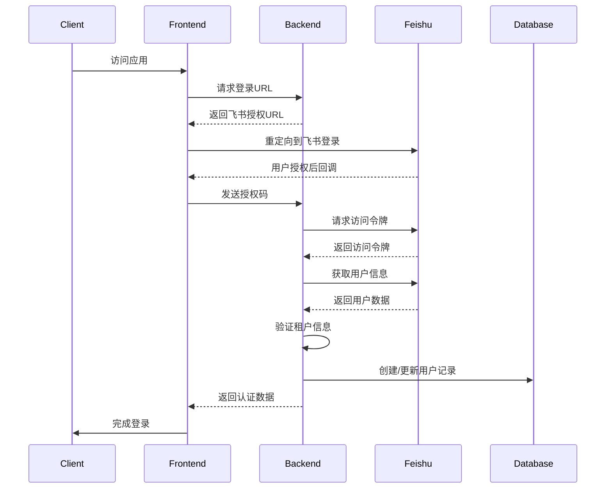
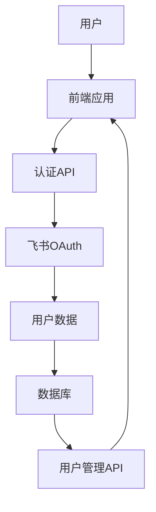

好的,让我帮你规划飞书登录的实现步骤:

1. 首先在 `.env` 添加飞书相关配置:
```ini
# 添加飞书配置
FEISHU_APP_ID=cli_xxx         # 飞书应用 ID
FEISHU_APP_SECRET=xxx         # 飞书应用密钥
FEISHU_REDIRECT_URI=http://localhost:8000/api/auth/feishu/callback  # 开发环境回调地址
```

2. 创建认证相关的目录结构:
```
backend/
├── auth/
│   ├── __init__.py
│   ├── oauth.py          # OAuth2.0 认证逻辑
│   ├── models.py         # 用户模型
│   └── dependencies.py   # 认证依赖
```

3. 创建用户模型 `auth/models.py`:
```python
from sqlalchemy import Column, Integer, String, DateTime
from database import Base
from datetime import datetime

class User(Base):
    __tablename__ = "users"
    
    id = Column(Integer, primary_key=True)
    feishu_user_id = Column(String(255), unique=True)
    name = Column(String(255))
    email = Column(String(255))
    avatar_url = Column(String(1024))
    access_token = Column(String(255))
    refresh_token = Column(String(255))
    token_expires_at = Column(DateTime)
    created_at = Column(DateTime, default=datetime.utcnow)
    updated_at = Column(DateTime, default=datetime.utcnow, onupdate=datetime.utcnow)
```

4. 实现 OAuth2.0 认证逻辑 `auth/oauth.py`:
```python
from fastapi import APIRouter, HTTPException, Depends
from sqlalchemy.orm import Session
from datetime import datetime, timedelta
import httpx
from typing import Optional
import os
from database import get_db
from .models import User

router = APIRouter()

FEISHU_APP_ID = os.getenv("FEISHU_APP_ID")
FEISHU_APP_SECRET = os.getenv("FEISHU_APP_SECRET")
FEISHU_REDIRECT_URI = os.getenv("FEISHU_REDIRECT_URI")

@router.get("/api/auth/feishu/login")
async def feishu_login():
    """生成飞书授权链接"""
    auth_url = (
        "https://open.feishu.cn/open-apis/authen/v1/index"
        f"?app_id={FEISHU_APP_ID}"
        f"&redirect_uri={FEISHU_REDIRECT_URI}"
        "&state=random_state"  # 实际使用时应该生成随机state
    )
    return {"auth_url": auth_url}

@router.get("/api/auth/feishu/callback")
async def feishu_callback(
    code: str,
    state: str,
    db: Session = Depends(get_db)
):
    """处理飞书回调"""
    try:
        # 1. 获取访问令牌
        async with httpx.AsyncClient() as client:
            token_response = await client.post(
                "https://open.feishu.cn/open-apis/authen/v1/access_token",
                json={
                    "app_id": FEISHU_APP_ID,
                    "app_secret": FEISHU_APP_SECRET,
                    "grant_type": "authorization_code",
                    "code": code
                }
            )
            token_data = token_response.json()
            
            if token_response.status_code != 200:
                raise HTTPException(status_code=400, detail="Failed to get access token")
                
        # 2. 获取用户信息
        access_token = token_data["access_token"]
        async with httpx.AsyncClient() as client:
            user_response = await client.get(
                "https://open.feishu.cn/open-apis/authen/v1/user_info",
                headers={"Authorization": f"Bearer {access_token}"}
            )
            user_data = user_response.json()
            
        # 3. 创建或更新用户
        user = db.query(User).filter_by(feishu_user_id=user_data["user_id"]).first()
        if not user:
            user = User(
                feishu_user_id=user_data["user_id"],
                name=user_data["name"],
                email=user_data.get("email", ""),
                avatar_url=user_data.get("avatar_url", ""),
            )
            db.add(user)
            
        # 更新令牌信息
        user.access_token = token_data["access_token"]
        user.refresh_token = token_data["refresh_token"]
        user.token_expires_at = datetime.utcnow() + timedelta(seconds=token_data["expires_in"])
        
        db.commit()
        
        # 4. 返回登录成功信息
        return {
            "status": "success",
            "user": {
                "id": user.id,
                "name": user.name,
                "email": user.email,
                "avatar_url": user.avatar_url
            }
        }
        
    except Exception as e:
        raise HTTPException(status_code=500, detail=str(e))
```

5. 在 `main.py` 中引入认证路由:
```python
from auth.oauth import router as auth_router

app = FastAPI()
# ... 其他配置 ...

# 添加认证路由
app.include_router(auth_router)
```

这是第一步的基础实现,包含了:
1. 环境配置
2. 用户模型定义
3. OAuth2.0 基本流程实现
4. 用户信息存储

后续还需要:
1. 实现令牌刷新机制
2. 添加会话管理
3. 实现权限控制
4. 添加安全措施(CSRF防护等)
5. 完善错误处理

需要我继续实现这些功能吗？


飞书返回信息
{
  "code": 0,
  "data": {
    "name": "吴川",
    "en_name": "Xavier",
    "email": "xavier@jtcargo.id",
    "enterprise_email": "xavier@jtcargo.id",
    "mobile": "+6281319039501",
    "tenant_key": "1794ea19cede5758",
    "user_id": "ID00000048",
    "open_id": "ou_8bd1a2f64507facb4b19c1ecd023c0c1",
    "union_id": "on_85f5929baa6ffdf32be605e4ff0aa285",
    "avatar_url": "https://s16-imfile-sg.feishucdn.com/..."
  },
  "msg": "success"
}


让我帮你总结用户认证和管理的完整流程：

1. 用户模型定义 (`models.py`):
```python
class User(Base):
    __tablename__ = "users"
    
    # 基本信息
    id = Column(UUID(as_uuid=True), primary_key=True, default=uuid.uuid4)
    feishu_user_id = Column(String(255), unique=True, nullable=False)
    name = Column(String(255), nullable=False)
    en_name = Column(String(255))
    email = Column(String(255))
    mobile = Column(String(255))
    avatar_url = Column(String(1024))
    tenant_key = Column(String(255), nullable=False)
    
    # 认证相关
    access_token = Column(String(255))
    refresh_token = Column(String(255))
    token_expires_at = Column(DateTime)
    
    # 用户状态
    is_active = Column(Boolean, default=True)
    last_login_at = Column(DateTime)
    login_count = Column(Integer, default=0)
    
    # 审计字段
    created_at = Column(DateTime, default=datetime.utcnow)
    updated_at = Column(DateTime, default=datetime.utcnow, onupdate=datetime.utcnow)
```

2. 认证流程 (`oauth.py`):

A. 登录流程：
```python
@router.get("/api/auth/feishu/login")
async def feishu_login():
    # 1. 生成随机状态值防止CSRF
    state = secrets.token_urlsafe(16)
    
    # 2. 构建飞书授权链接
    auth_url = (
        "https://open.feishu.cn/open-apis/authen/v1/index"
        f"?app_id={FEISHU_APP_ID}"
        f"&redirect_uri={FEISHU_REDIRECT_URI}"
        f"&state={state}"
    )
    
    return {"auth_url": auth_url}
```

B. 回调处理：
```python
@router.get("/api/auth/feishu/callback")
async def feishu_callback(code: str, state: str, db: Session):
    # 1. 获取访问令牌
    token_response = await get_access_token(code)
    access_token = token_response["data"]["access_token"]

    # 2. 获取用户信息
    user_data = await get_user_info(access_token)

    # 3. 验证组织身份
    validate_tenant(user_data["tenant_key"])

    # 4. 创建或更新用户
    user = create_or_update_user(db, user_data, access_token)

    # 5. 返回认证数据
    return generate_auth_response(user)
```

C. Token 刷新：
```python
@router.get("/api/auth/refresh")
async def refresh_token(current_token: str, db: Session):
    # 1. 验证当前token
    user = validate_token(current_token, db)
    
    # 2. 生成新的过期时间
    new_expires_at = datetime.now() + timedelta(hours=TOKEN_EXPIRE_HOURS)
    
    # 3. 更新用户token
    update_user_token(user, new_expires_at)
    
    return {"expires_at": new_expires_at.timestamp()}
```

3. 用户管理 (`user_router.py`):

A. 用户认证中间件：
```python
async def get_authenticated_user(
    credentials: HTTPAuthorizationCredentials,
    db: Session
) -> User:
    token = credentials.credentials
    return await get_current_user(db=db, access_token=token)
```

B. 用户列表查询：
```python
@router.get("/auth/users")
async def get_users(
    page: int,
    page_size: int,
    db: Session,
    current_user: User
):
    # 1. 计算分页
    skip = (page - 1) * page_size
    
    # 2. 获取总数和用户列表
    total = db.query(User).count()
    users = db.query(User).order_by(User.created_at.desc()).offset(skip).limit(page_size).all()
    
    # 3. 格式化响应
    return format_user_list_response(users, total, page, page_size)
```

C. 用户搜索：
```python
@router.get("/auth/users/search")
async def search_users(
    q: str,
    db: Session,
    current_user: User
):
    # 1. 构建搜索查询
    query = build_search_query(db, q)
    
    # 2. 执行查询
    users = query.order_by(User.created_at.desc()).all()
    
    # 3. 格式化响应
    return format_search_response(users)
```

4. 完整认证流程：



5. 关键安全特性：

- Token 过期时间：168小时（7天）
- CSRF 防护：使用 state 参数
- 组织验证：验证 tenant_key
- 访问控制：所有用户API需要认证
- 数据库事务：确保用户数据一致性
- 错误处理：完整的错误捕获和日志记录

6. 数据流：



7. 主要API端点：

```plaintext
认证相关：
- GET /api/auth/feishu/login      # 获取登录URL
- GET /api/auth/feishu/callback   # 处理认证回调
- GET /api/auth/refresh           # 刷新token

用户管理：
- GET /api/auth/users             # 获取用户列表
- GET /api/auth/users/search      # 搜索用户
```

这个系统提供了：
1. 完整的飞书OAuth认证流程
2. 用户信息的持久化存储
3. 基于token的访问控制
4. 用户管理和搜索功能
5. 完善的错误处理和日志记录

需要我详细解释任何部分吗？


ai翻译开发：
让我帮你总结一下 `translate_multilingual` 接口的实现细节：

1. API 端点信息：
```
URL: /api/translate/multilingual
Method: POST
Content-Type: multipart/form-data
```

2. 入参数：
```typescript
{
  text: string;  // 必填，要翻译的文本内容
}
```

3. 出参数：
```typescript
{
  status: "success";
  translations: {
    detected_language: string;  // 检测到的语言
    english: string;           // 英文翻译
    chinese: string;          // 中文翻译
    indonesian: string;       // 印尼文翻译
  }
}
```

4. 实现逻辑：

在 `term_extractor.py` 中：
```python
async def translate_multilingual(self, text: str) -> dict:
    # 1. 输入验证
    if not self._is_valid_input(text):
        return {
            "error": "Invalid input - empty, meaningless, or contains only symbols/emojis"
        }

    # 2. 构建 AI 提示词，包含以下分析要点：
    # - 语言和文化背景
    # - 上下文元素
    # - 情感和语用方面
    
    # 3. 调用 AI API 进行翻译
    response = await self._generate_with_retry_backoff([{"text": prompt}])
    
    # 4. 解析响应，只返回翻译结果
    result = self._parse_translations_only(response.text)
    
    return result
```

在 `main.py` 中：
```python
@app.post("/api/translate/multilingual")
async def translate_multilingual_text(text: str = Form(...)):
    try:
        # 1. 输入验证
        if not text.strip():
            raise HTTPException(400, "Input text cannot be empty")

        # 2. 创建翻译器实例
        term_extractor = GeminiTermExtractor()
        
        # 3. 执行翻译
        result = await term_extractor.translate_text_with_language_detection(text)
        
        # 4. 错误处理
        if "error" in result:
            raise HTTPException(400, result["error"])

        # 5. 返回结果
        return {
            "status": "success",
            "translations": {
                "detected_language": result["detected_language"],
                "english": result["english"],
                "chinese": result["chinese"],
                "indonesian": result["indonesian"]
            }
        }
    except Exception as e:
        # 错误处理
        raise HTTPException(500, "An unexpected error occurred")
```

5. 主要特点：
- 使用 Google AI (Gemini) 进行翻译
- 自动检测输入语言
- 支持中文、英文、印尼文三种语言的互译
- 包含输入验证，过滤无效输入
- 考虑文化背景和语境的翻译
- 包含完善的错误处理机制
- 使用重试机制确保 API 调用的可靠性

6. 错误处理：
- 400: 输入为空或无效
- 500: 服务器内部错误
- 包含详细的错误代码和消息

这个接口的设计考虑了多语言翻译的复杂性，不仅仅是简单的文本转换，还包含了文化和语境的理解，确保翻译结果更加准确和自然。
